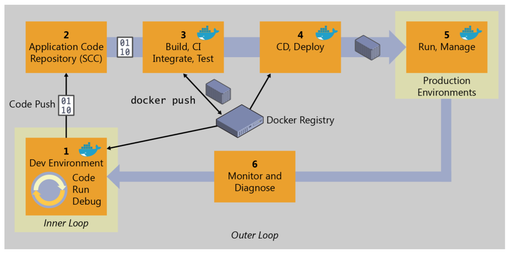

# DevOps Architectural Decisions

## Service Platform

|  Category | Concern  | Options (examples)  | Reference Architecture  | Rationale  |
|---|---|---|---|---|
| Observability  | Distributed Logging  | - ElasticSearch, Fluentd, Kibana (EFK) <br/> - ElasticSearch, Logstash, Kibana (EFK) <br/> - Splunk |   |   |
|   | Distributed Tracing  | - Jaeger <br/> - Zipkin  |   |   |
|  Continuous Integration | Build Pipelines  | - Bamboo <br/> - Jenkins <br/> - GitLab CI  |   |   |
|||||
|||||
|||||
|||||
|||||
|||||


## Developer Environment for Docker apps

|  Concern | Options  | Reference Architecture  | Rationale  |
|---|---|---|---|---|
| IDE  | - IntelliJ |  |   |   
| Docker | - Docker CLI  ||
| Language | - Java <br/> - JavaScript ||
| Frameworks | - MicroProfile <br/> - Thorntail <br/> - JBoss EAP||
||||

## Developer INNER LOOP


|  Concern | Options  | Reference Architecture  | Rationale  |
|---|---|---|---|---|
|  |  |  |  |
|  |  |  |  |
|  |  |  |  |

## Developer OUTER LOOP



|  Concern | Options  | Reference Architecture  | Rationale  |
|---|---|---|---|---|
|  |  |  |  |
|  |  |  |  |
|  |  |  |  |

# Examples


## WebApplication1 Reference Implementation

|  Category | Concern | Decision |
|---|---|---|
| 0. Developer Environment | 0.1 IDE | Visual Studio |
|| 0.2 Docker | Docker Tools |
|| 0.3 Language | C# |
|| 0.4 Framework | - .NET Core <br/> - ASP.NET Core <br/> - EF Core |
|| 0.5 Branching | - Local Feature Branch and local commits <br/>  
| 1. Developer INNER LOOP | 1.1 SCM | Azure DevOps Git |
|| 1.2 Docker Files | Generated by Visual Studio Docker Tools |
|| 1.3 Create Images | - Local Docker (Dev PC) Repository <br/> - Base images from Docker Hub <br/> |
|| 1.4 Define Services | - Docker Compose file (dev, prod) |
|| 1.5 Run Containers | - Local Docker Compose (Dev PC) <br/> - Infra containers mocked with lightweight images |
|| 1.6 Test App & Services | - Run (docker-compose) in local (Dev PC) Docker host <br/> - Launch with CLI or run Visual Studio Docker Compose project <br/> - Visual Studio attaches to shared docker volume for debugging |
|| 1.7 Push Commits | - Push local Feature Branch to trigger CI |


## Tailspin DevOps Training

## Istio Tutorial

Customer
========

This is the customer microservice, part of the Istio Tutorial demo. Even though this microservice is meant to be executed within a Container on a Pod on Kubernetes/OpenShift, it can still be executed on bare metal.

This is a regular Wildfly Swarm application, with OpenTracing and Jaeger dependencies to provide distributed tracing capabilities.

Running on the local machine
============================

To run this service for development purposes on your own machine, execute:

```bash
JAEGER_SERVICE_NAME=customer mvn wildfly-swarm:run
```

The environment variable `JAEGER_SERVICE_NAME` is required, as the Jaeger Tracer is embedded into our application and expects a service name to be specified. The example should work, however, even when an installation of Jaeger is *not* available.

If you do prefer to have a local Jaeger instance running to see the traces, the easiest is to start via a Docker
container:

```bash
docker run \
  --rm \
  -p5775:5775/udp \
  -p6831:6831/udp \
  -p6832:6832/udp \
  -p16686:16686 \
  -p14268:14268 \
  jaegertracing/all-in-one:1.3
```

The default configuration for the Jaeger tracer samples only a small portion of the requests. To trace every incoming request and report the spans to the log file, export the following environment variables and start the application again:

```bash
export JAEGER_REPORTER_LOG_SPANS=true
export JAEGER_SAMPLER_TYPE=const
export JAEGER_SAMPLER_PARAM=1
```

To test, call http://localhost:8280/

```
$ curl http://localhost:8280/
customer => preference => recommendation v1 from 'caju': 3
```


Running on OpenShift
====================

The following commands will build a Docker image containing the application, create a Kubernetes `Deployment` and a corresponding `Service`, so that other services can discover the pods via the service name.

```bash
mvn clean package
docker build -t example/customer .
docker images | grep customer
oc apply -f ../../kubernetes/Deployment.yml
oc apply -f ../../kubernetes/Service.yml
oc expose service customer
```

The last command will expose the service to the outside world, allowing you to make an HTTP call directly from your host machine:

```
curl http://customer-tutorial.127.0.0.1.nip.io/
```
